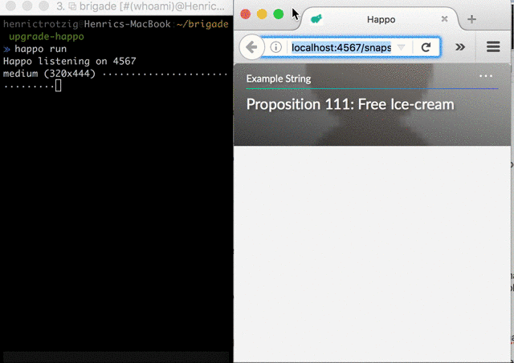

# Happo

***

*This project is no longer actively maintained. New development, including cross-browser support, easier CI integration, etc takes place at https://happo.io*

***

Happo is a screenshot testing tool. [Read more][end-of-visual-regressions].

[end-of-visual-regressions]: https://medium.com/brigade-engineering/the-end-of-visual-regressions-b6b5c3d810f


## Installation

Happo comes bundled as an npm package. To install it, run

```sh
npm install --save-dev happo
```

You will also want to install a [target plugin](#Targets) and an [uploader plugin](#Uploaders).

## Introduction

Happo works by running twice. It first needs to run on the "current" version of
the code (generally latest `master`) to take screenshots of the current version
of your components. Then, it runs on the "next" version of the code (generally
your working branch) to take new screenshots of your components and compare them
to the earlier version.

To set this up, you define a set of examples that Happo will grab snapshots for.
If a previous snapshot exists for a component, Happo will diff the new snapshot
with the previous. If a diff is found, a visual representation of the changes
will be constructed. You can then use that diff image to decide whether a visual
regression has been introduced or not, and take appropriate action based on that
information.



## Configuration

Happo loads configuration in one of the following ways:

- From a JavaScript file specified via a `HAPPO_CONFIG_FILE` environment variable
- From `.happo.js` in the current working directory

### Example configuration

```js
var FirefoxTarget = require('happo-target-firefox');
var S3Uploader = require('happo-uploader-s3');

module.exports = {
  // the name of the summary file
  // (default is shown below)
  resultSummaryFilename: 'resultSummary.json',

  // A function that returns an "Uploader" interface for CI.
  // (default: null)
  uploader: () => new S3Uploader(),

  // Specify the folder where snapshots are saved
  // (default: 'snapshots')
  snapshotsFolder: 'happo-snapshots',

  // An array of "targets" to run. Targets specify the environment to run
  // the snapshots in. Must specify at least one.
  // (default: [])
  targets: [
    new FirefoxTarget({
      // ... configuration for FirefoxTarget
    }),
  ],
};
```


## Targets

At the moment, `happo` only has one target, but more are coming!

- [`happo-target-firefox`](packages/happo-target-firefox)

## Uploaders

At the moment, `happo` only has one uploader, but more are coming!

- [`happo-uploader-s3`](packages/happo-uploader-s3)

## Command line API

### `happo run [<targetName>]`

This command will run all of the snapshots in the provided target name. If target
name is omitted, then all targets are run.

### `happo review`

Once `happo run` has finished, run `happo review` from the command line. This
will open a page that compares the latest run's snapshots against the previous
snapshots.

### `happo debug <targetName>`

If you want to debug rendering your examples, you can run `happo debug`. This
will open a browser window pointing at `/debug`, listing all your examples. If
you click one of them, the example will be rendered in isolation and you can do
use your developer tools to debug.

### `happo upload [<triggeredByUrl>]`

Uploads all current diff images using the uploader specified in the config.

If you want the diff page to link back to a commit/PR, you can pass in a URL as
the argument to `happo upload`. E.g.

```sh
happo upload "https://test.example"
```

### `happo upload-test`

Uploads a small text file to an AWS S3 account. This is useful if you want to
test your S3 configuration. Uses the same configuration as [`happo
upload`](#happo-upload-triggeredbyurl) does.

```sh
happo upload-test
```

## Running in a CI environment

The main purpose for Happo is for it to be run in a CI (Continuous
Integration) environment. The command line tools provided are designed to be
used as building blocks in a script that you can run in
[Travis](https://travis-ci.org/), [Jenkins](https://jenkins-ci.org/) and other
Continuous Integration environments.

Below is an example of how you can use Happo to test if a commit introduces
any visual change.

1. Check out the commit previous to the one to test (e.g. `git checkout HEAD^`)
1. (optionally) build your JavaScript and/or CSS
1. Run `happo run` to generate previous snapshots
1. Check out the commit to test
1. (optionally) build your JavaScript and/or CSS
1. Run `happo run` to diff against previously created snapshots
1. Run `happo upload` to upload diffs to a publicly accessible location

There's an example script implementing these steps located in
[happo_example.sh](happo_example.sh). Use that as a starting point for your own
CI script.

## In the wild

[Organizations and projects using Happo](INTHEWILD.md).
