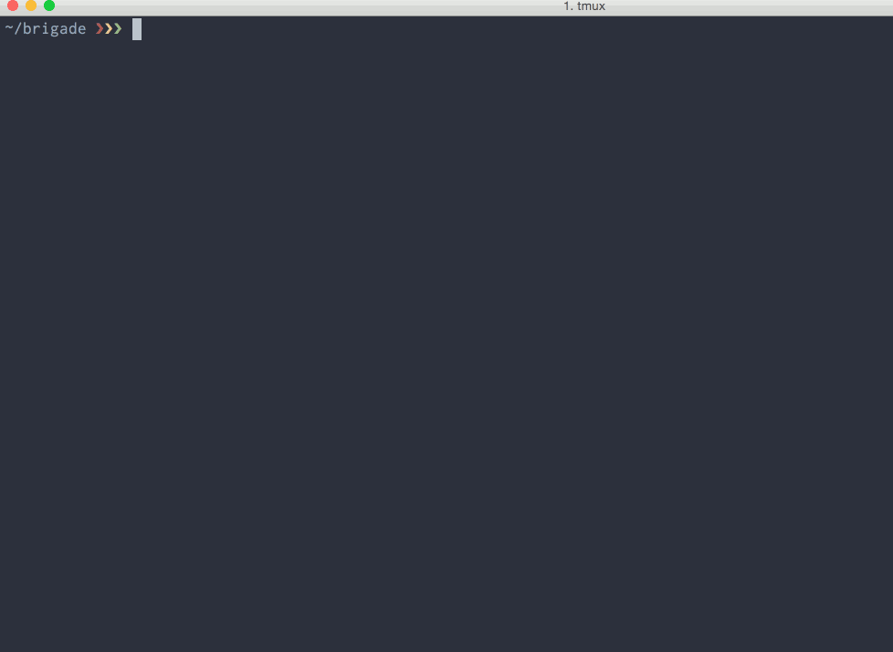

# Diffux-CI

Diffux-CI is a command-line tool to visually diff JavaScript components. [Read
more][end-of-visual-regressions].

[end-of-visual-regressions]: https://medium.com/brigade-engineering/the-end-of-visual-regressions-b6b5c3d810f

You begin by defining a set of examples that Diffux-CI will grab snapshots for.
If a previous snapshot (called a "baseline") exists for a component, Diffux-CI
will diff the new snapshot with the old baseline. If a diff is found, a visual
representation of the changes will be constructed. You can then use that diff
image to decide whether a visual regression has been introduced or not, and
take appropriate action based on that information.



## Defining examples

You define your examples in a JavaScript file and include it in the
`source_files` [configuration](#configuration) option.

Here's an example of a button component being added to a Diffux-CI suite:

```javascript
diffux.define('button', function() {
  var elem = document.createElement('button');
  elem.setAttribute('class', '.button');
  elem.innerHTML = 'Submit';
  document.body.appendChild(elem);
  return elem;
});
```

Examples are responsible themselves for rendering the element into the DOM.
This is because a lot of frameworks (e.g.
[React](https://facebook.github.io/react/)) like to stay in control over the
DOM. A helper method to reduce some of the boilerplate is probably a good idea
in your project.

During development, you might want to zoom in/focus on a single example. In
those situations, you can use the `diffux.fdefine` function instead of
`diffux.define`. Using `fdefine` will cause `diffux_ci` to only run for that
example.

### Setting viewport sizes

By default, Diffux-CI renders examples in a 1024 wide window. If you have
components that render differently depending on available screen size you can
use the `viewports` option in the object passed in as the second argument to
`diffux.define`. These need to correspond to configured `viewports` in the
`.diffux_ci.yaml` file. Diffux-CI comes pre-configured with three default sizes:
`large` (1024x768), `medium` (640x888), and `small` (320x444).

```javascript
diffux.define('responsive component', function() {
  var elem = document.createElement('div');
  elem.setAttribute('class', '.responsive-component');
  document.body.appendChild(elem);
  return elem;
}, { viewports: ['large', 'small'] });
```

### Controlling the snapshot

Diffux-CI can usually figure out what part of the screen belongs to your
component, and take the snapshot of that area. In some situations however, that
won't work. In those cases, you can pass in the `snapshotEntireScreen` option
to force a full-size snapshot to be taken.

```javascript
diffux.define('dialog window', function() {
  var elem = document.createElement('div');
  elem.setAttribute('class', '.dialog');
  document.body.appendChild(elem);
  return elem;
}, { snapshotEntireScreen: true });
```

### Async examples

If your examples need to do something asynchronous before they finish render,
you can use the `done` callback passed in to the define method.

```javascript
diffux.define('async component', function(done) {
  var elem = document.createElement('div');
  document.body.appendChild(elem);
  setTimeout(function() {
    elem.innerHTML = 'Async content loaded';
    done(elem);
  }, 100)
});
```

## Installation

Diffux-CI comes bundled as a gem. To install it, run `gem install diffux_ci`.

## Configuration

Diffux-CI loads configuration in one of the following ways:

- From a YAML file specified via a `DIFFUX_CI_CONFIG_FILE` environment variable
- From `.diffux_ci.yaml` in the current working directory

```yaml
source_files:
 - application.js
 - diffux_ci-examples.js
stylesheets:
 - application.css
snapshots_folder: ./snapshots
viewports:
  large:
    width: 1024
    height: 768
  small:
    width: 320
    height: 444
s3_access_key_id: <your acccess key id>
s3_secret_access_key: <your secret acccess key>
```

## Command line tools

### `diffux_ci`

This command will fire up a Firefox instance and take snapshots of all your
diffux examples.

### `diffux_ci review`

Once `diffux_ci` has finished, run `diffux_ci review` from the command line. This
will open a page that compares the latest run's snapshots against the
previously accepted snapshots. You can then approve or reject the snapshots for
the next run.

### `diffux_ci upload_diffs`

Uploads all current diff images to an Amazon S3 account and reports back URLs
to access those diff images. Requires the `s3_access_key_id` and
`s3_secret_access_key` configuration options.

### `diffux_ci clean`

Recursively removes everything in the snapshots folder (configured through
`snapshots_folder`).

## Running in a CI environment

The main purpose for Diffux-CI is for it to be run in a CI (Continuous
Integration) environment. The command line tools provided are designed to be
used as building blocks in a script that you can run in
[Travis](https://travis-ci.org/), [Jenkins](https://jenkins-ci.org/) and other
Continuous Integration environments.

Below is an example of how you can use Diffux-CI to test if a commit introduces
any visual change.

1. Check out the commit previous to the one to test (e.g. `git checkout HEAD^`)
2. (optionally) precompile your JavaScript and/or CSS
3. Run `diffux_ci` to generate baseline snapshots
4. Check out the commit to test
5. (optionally) precompile your JavaScript and/or CSS
6. Run `diffux_ci` to diff against previously created snapshots
7. Run `diffux_ci upload_diffs` to upload diffs to a publicly accessible location

There's an example script implementing these steps located in
[diffux_ci_example.sh](diffux_ci_example.sh). Use that as a starting point
for your own CI script.

### Headless Diffux-CI

Since Diffux-CI uses Firefox to generate its snapshots, you need a display.  If
you are on a build server, you usually don't have a screen. To run `diffux_ci`
then, you can use a virtual display server such as
[xvfb](http://www.x.org/archive/X11R7.6/doc/man/man1/Xvfb.1.xhtml).  The
[example CI script](diffux_ci_example.sh) as well as the internal Travis test
run for Diffux-CI uses `xvfb-run` in order to obtain a virtual display. There are
other tools that can help you with this as well, for example the [headless
gem](https://github.com/leonid-shevtsov/headless).
